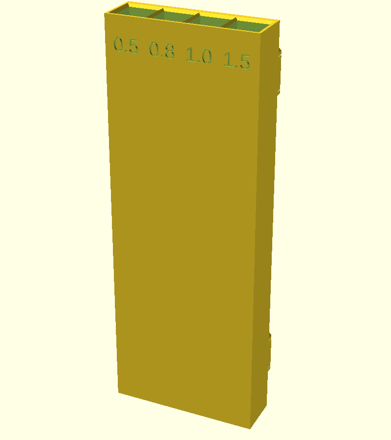
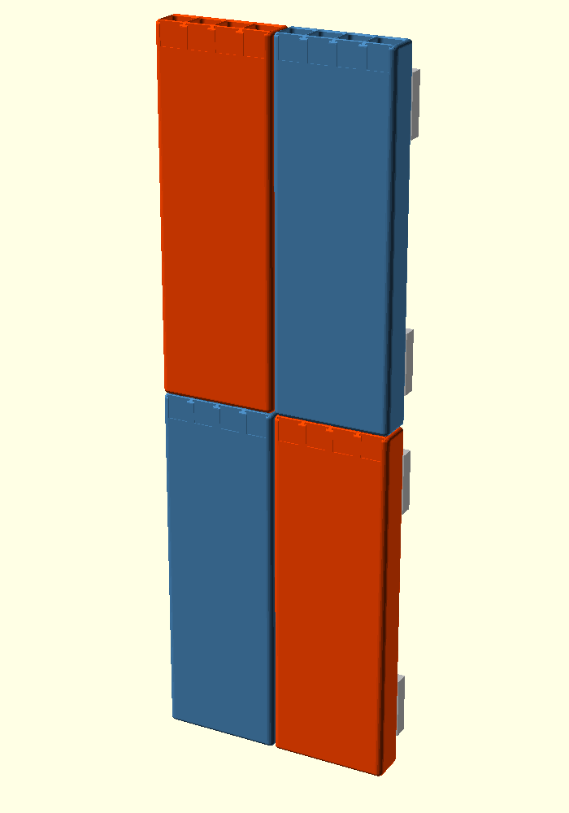
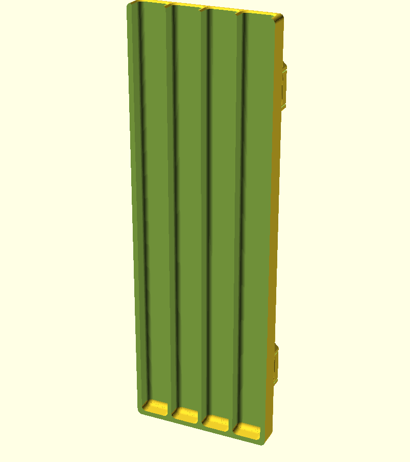
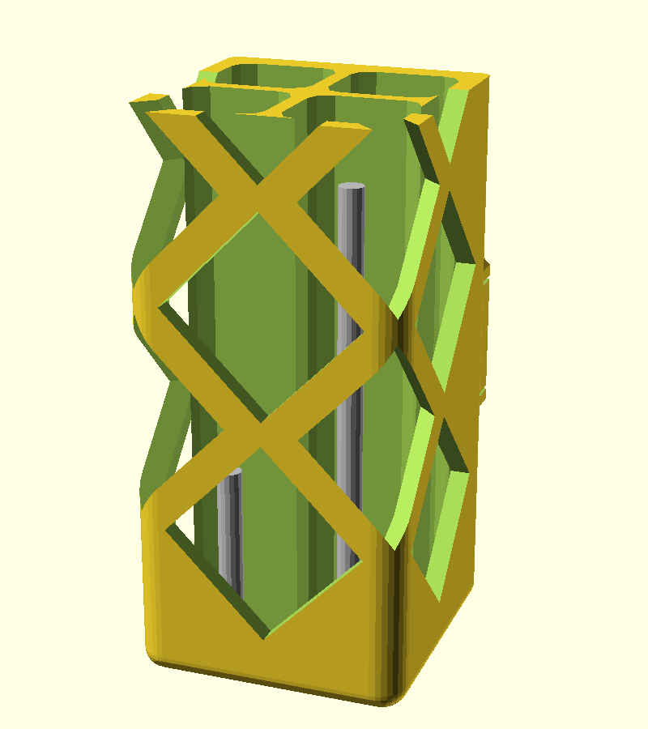
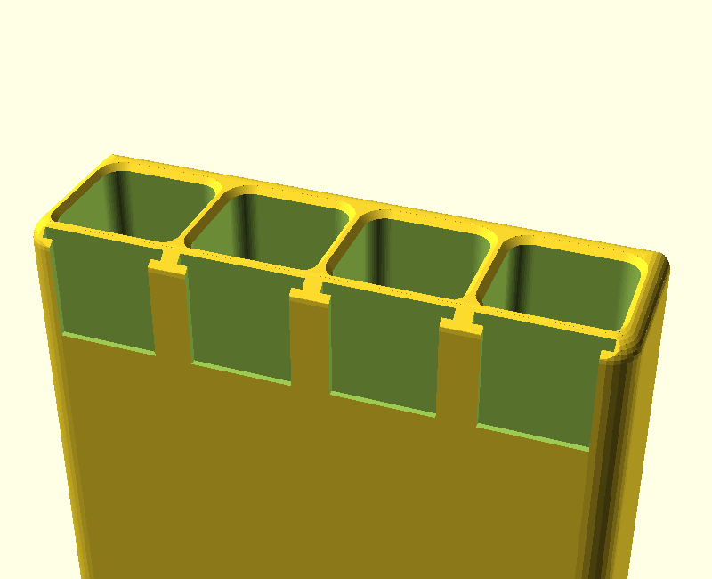
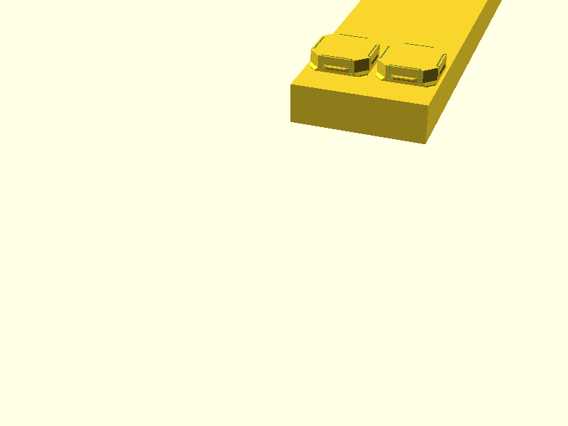

# openGrid Rod Holder

A deep, narrow pot that snaps onto an [openGrid](https://www.opengrid.world/)
board and keeps thin steel rod sorted by diameter. Built for 0.5 mm and 0.8 mm
hinge pin stock, but every dimension is parametric.



- 1 grid cell square, 6 cells tall: 27.6 x 27.6 x 167.6 mm
- 4 compartments in a 2 x 2 grid, 11.0 x 10.5 mm, 165.6 mm deep, rounded inside
- A lattice of diamond windows up the outer walls, wrapping round the front
  corners, so short offcuts at the bottom can be seen
- Card label pocket for every compartment: front row on the front, back row on
  the sides
- Mounts on 2 snaps: one at the top, one at the bottom
- Tiles in both directions, so a wall of them lines up

Sized for 300 mm rod: the pot holds the bottom 166 mm and the rest stands
proud, so a full length rod is easy to grab.

Version 1 was 2 cells wide with 4 compartments in a single row. That is still
one setting away, see [v1 layout](#v1-layout).

## Requirements

The openGrid connector geometry lives in a separate library so other openGrid
projects can share it:

```sh
git clone https://github.com/morganp/openscad-opengrid.git \
  ~/Documents/OpenSCAD/libraries/opengrid
```

Then open `rod_holder.scad` in OpenSCAD.

Or open it in the browser with no install, library included:
[rod_holder.scad in the web OpenSCAD GUI](https://lizard-spock.co.uk/openscad-gui/?github=morganp/Openscad_rod_holder/rod_holder.scad).
The `// @github: morganp/openscad-opengrid` comment above the `include` tells
the web GUI where to fetch the library from; desktop OpenSCAD ignores it.

---

## Tiling



*Four holders in a 2 x 2 block, with the board cells their snaps sit in shown behind.*

The outer size is a whole number of grid cells **less `tile_clearance`**, taken
off the outside so the snaps stay put. At the defaults the holder is 27.6 x
167.6 mm and sits on a 28 x 168 mm footprint, which is 1 x 6 cells. It sits flush
beside any other holder or bin built to whole grid cells, and six-cell holders
stack flush above each other. Butt them up
against each other and every snap still lands on the 28 mm grid, with 0.4 mm of
air between neighbours so they do not rub.

Vertical tiling is what `height_mode` is for:

| `height_mode` | Height | Bore | Tiles vertically |
|---|---|---|---|
| `"grid"` (default) | Rounded up to a whole number of cells, 167.6 | 165.6 | Yes |
| `"exact"` | `bore_depth + floor_thickness`, 160 | 158 | No |

In `"grid"` mode `bore_depth` is a **minimum**. The height rounds up to the next
whole cell and the spare goes into the bore, so asking for 158 mm gets you
165.6 mm rather than 8 mm of dead plastic in the base. Use `"exact"` if you
want the bore depth you asked for and do not care about stacking.

---

## Layout

The pot's back wall *is* the mounting plate, so there is no separate bracket.
Snaps sit in the top and bottom rows only, one per column of grid cells.

Compartments form a grid: `compartments` across and `compartment_rows` front to
back. The depth comes from `pot_depth`:

| `pot_depth` | Depth | Compartments |
|---|---|---|
| `-1` (default) | Matches the width, 27.6 | Share the space behind the front wall, 10.5 deep each |
| `0` | `back_plate + rows * depth + dividers + wall` | `compartment_depth` deep, or square if that is 0 |
| any other value | That value | Share the space behind the front wall |

Snap centres have to land on the 28 mm grid and need 14 mm of clearance to any
plate edge, so the rows are pushed as far apart as the height allows and the
pair is centred:

```
snap_span = floor((pot_h - 28) / 28) * 28
snap_z0   = (pot_h - snap_span) / 2
```

At 167.6 mm tall that puts the rows 112 mm apart at z = 27.8 and z = 139.8.
Change `bore_depth` and they move to suit.



*Cut down the middle of the left column: the front and back bores, the floor, the diamond windows cut through the front wall, and the back plate the snaps hang off.*

---

## Windows



*The bottom of a holder from the front corner, with short offcuts standing in
the compartments. Offcuts drawn thicker than real rod so they show up.*

Rod gets used up from the top, so the pieces that get forgotten are the short
offcuts sitting at the bottom of a 166 mm deep bore. A lattice of diamond
windows runs up the outer walls so you can see them without tipping the holder
out.

The diamonds sit in alternating rows:

- **Row A** puts one diamond in the middle of each face. On the front it is
  centred on the grid cell, so on a 1 cell holder it spans both compartment
  columns. On each side it is centred between the back plate and the front
  wall, so it spans both compartment rows.
- **Row B**, half a pitch higher, puts a diamond on each front vertical edge.
  It wraps round the corner, half on the front and half on the side, and opens
  up the front corner of the compartment behind it. It is cut as one prism
  running in along the corner's 45 degree bisector, so the outline runs
  continuously over the rounded edge and each face still shows a 45 degree
  half diamond. Cutting a half diamond straight into each face instead leaves
  pinched nubs where the webs cross the rounded corner. On holders wider than one
  cell, row B also has a full diamond on the front at every cell boundary.
- The back edges and the back plate stay solid. That is where the snaps are.

At the defaults the diamonds are 20.2 mm across, 45 degree squares, with a
2.4 mm web between neighbours. There are 12 rows, 22.6 mm apart for rows of
the same kind: 6 A rows and 6 B rows, from 6 mm above the bottom to just below
the card pockets. So each side face has 6 full diamonds and 6 half diamonds
round the corner, and the front has 6 full diamonds and 12 corner halves.

`diamond_size = 0` makes the diamonds as big as the faces allow, and a larger
value is clamped to that with a note in the console. The spacing follows from
the size and `diamond_web`: rows of the same kind are spaced so their tips are
a web apart, and an A and a B diamond are a web apart across the diagonal.

The windows only cut the outer walls. Where a row A diamond crosses the end of
a divider it takes the wall off the end of the divider, but the divider stays
joined to the back plate, to the other divider, and to the outer wall at every
row B height, so the part is still one solid. At the wrapped corners the cut
also clears the rounded inside corner of the compartment, which would
otherwise be left as a thin free standing sliver in the middle of the opening.

**Why the windows start above the floor.** The lowest diamond tip is
`window_start` (4 mm) above the floor. A rod standing in a compartment rests its
bottom end on the floor behind solid wall, so to lean out of a window it would
have to be lifted over that band first. Gravity keeps it seated, and a rod
leaning against a window can only poke its *top* end out, which slides it
upwards, not out. Offcuts shorter than the compartment is wide can lie flat on
the floor, below the windows. The holder can still lose short pieces if it is
knocked off the wall or turned upside down.

**Tiling hides the side windows.** Holders butted up to each other cover each
other's side faces. The front diamonds and the front halves of the corner
diamonds still show all four compartments' front corners; the back row is only
fully visible from a free side (the end of a row), a one cell gap, or the top.

**Printing.** Front face down, the front diamonds are holes in the first
layers, and every edge of the side diamonds runs at 45 degrees, so there are no
bridges and no support.

`window_style = "slot"` gives the earlier ladder of narrow slots, one column per
compartment, and `"none"` leaves the walls solid.

---

## Rounding



*The top of the pot: rounded outer edges, the lead-in at each mouth, front card
pockets for the front row, a side pocket for the back row, and the top of the
diamond lattice with a corner diamond wrapping the front edge.*

Outside, the two front vertical edges are rounded by `outer_round`, the top and
bottom edges by `end_round`. Inside, the compartment corners are rounded by
`inner_round` and there is a fillet where the walls meet the floor.

Two edges cannot simply be rounded, for reasons worth knowing before you change
the values:

**The back edges.** Rounding the back face perimeter eats into the flat area the
snaps root into. Each snap reaches 12.4 mm from its centre and a one cell pot
is 13.8 mm from centre to side, so anything above 1.4 mm would undercut them. `back_round` defaults
to 1.2 and is checked by an assert.

**The front face perimeter.** The front face is the bed when printing. A fillet
tangent to the bed leaves the first layers as a near-horizontal overhang, which
prints badly. So the rounding is cut back to 45 degrees where it runs into that
face, by `front_chamfer`. This catches the side edges and the top and bottom
edges in one operation. Set `front_chamfer = 0` for an unbroken round, and print
with support.

The mouth lead-in grows every compartment sideways and backwards, so two
neighbours eat into the divider between them from both sides. It is clamped to
leave at least 0.4 mm on top of each divider, which means the effective lead-in
can be smaller than `mouth_chamfer` asks for. It never grows into an outer wall
that carries a card pocket.

---

## Card labels

Every compartment gets a pocket in an outer wall that holds a slip of card
behind a window. Cards drop in from the top of the pot and pull straight back
out, so relabelling means writing a new slip rather than reprinting the holder.

- Front row compartments are labelled on the front face.
- Rows behind that are labelled on the side wall they touch: the left back
  compartment on the left side, the right one on the right. A single column
  uses the left side.
- A compartment that touches no outer wall (a middle column of three or more,
  behind the front row) cannot be labelled, and OpenSCAD echoes a note.

At the defaults the front cards are 11.0 x 12 mm with a 9.0 x 11 mm window, the
side cards 10.5 x 12 mm with an 8.5 x 11 mm window, all in 0.7 mm slots. Cut a
strip of 300 gsm card, or fold ordinary paper double.

Set `label_mode = "engraved"` to cut fixed text into the same faces instead, or
`"none"` to leave it plain. `labels` runs front row left to right as mounted,
then the next row back, left to right.

---

## Parameters

### openGrid

| Parameter | Default | Description |
|---|---|---|
| `grid_cols` | `1` | How many grid cells wide |
| `lite_board` | `false` | `true` for a 4.0 mm Lite board, `false` for a 6.8 mm Full board |
| `snap_clearance` | `0` | Raise to 0.05 to 0.1 if the snaps print tight |
| `tile_clearance` | `0.4` | Gap left between neighbouring holders. Taken off the outside, the snaps stay on the grid |
| `height_mode` | `"grid"` | `"grid"` rounds the height to whole cells so holders tile vertically. `"exact"` gives exactly `bore_depth + floor_thickness` |

### Pot

| Parameter | Default | Description |
|---|---|---|
| `bore_depth` | `158` | Usable compartment depth. A minimum in `"grid"` mode |
| `compartments` | `2` | Number of compartments across the width |
| `compartment_rows` | `2` | Number of compartment rows, front to back |
| `pot_depth` | `-1` | `-1` matches the width, `0` sizes from `compartment_depth`, any other value is the depth |
| `wall` | `2.0` | Front and side wall thickness |
| `divider` | `1.6` | Thickness of the walls between compartments |
| `back_plate` | `3.0` | Back plate thickness, this is what the snaps hang off |
| `floor_thickness` | `2.0` | Material under the compartments |
| `compartment_depth` | `0` | Front to back size, used only when `pot_depth = 0`. `0` makes the compartments square |
| `mouth_chamfer` | `1.0` | Lead-in at the mouth. Never opens into a wall with a card pocket. Clamped so it cannot eat the divider tops away |

Compartment width is whatever is left over:

```
comp_w = (grid_cols * 28 - tile_clearance - 2 * wall
          - (compartments - 1) * divider) / compartments
```

which gives 11.0 mm at the defaults, and the depth is shared the same way
behind the front wall, 10.5 mm.

### Windows

| Parameter | Default | Description |
|---|---|---|
| `window_style` | `"diamond"` | `"diamond"` lattice, `"slot"` ladders, or `"none"` |
| `window_sides` | `true` | Windows in the side walls |
| `window_front` | `true` | Windows in the front wall |
| `window_start` | `4` | Solid band above the floor before the first window |
| `window_zone` | `0` | Height of the windowed region above `window_start`. `0` runs up to just below the labels |
| `diamond_size` | `0` | Diamond diagonal. `0` is as big as the faces allow, larger values are clamped to that |
| `diamond_web` | `2.4` | Narrowest web between diamonds, and between diamonds and the labels. At least 1.6 |
| `diamond_corners` | `true` | Diamonds wrapped round the two front vertical edges |
| `window_width` | `4` | Slot style only. Slot width, clamped to the flat part of the compartment wall |
| `window_height` | `10` | Slot style only. Height of each slot, and the bridge over it when printing |
| `window_bar` | `4` | Slot style only. Solid rung between slots |

### Rounding

| Parameter | Default | Description |
|---|---|---|
| `outer_round` | `3.0` | Radius on the two front vertical edges, the ones you grip |
| `back_round` | `1.2` | Radius on the two back vertical edges. Capped by the snap footprint, see above |
| `end_round` | `2.0` | Radius on the top and bottom outer edges |
| `front_chamfer` | `1.6` | 45 degree relief where the rounding meets the front face, so it prints off the bed. `0` gives an unbroken round |
| `inner_round` | `2.0` | Radius on the inside vertical corners of each compartment |
| `floor_round` | `2.0` | Radius where the compartment walls meet the floor |

### Labels

| Parameter | Default | Description |
|---|---|---|
| `label_mode` | `"card"` | `"card"`, `"engraved"` or `"none"` |
| `card_height` | `12` | Height of the card pocket. Width follows the compartment |
| `card_thickness` | `0.7` | Thickness of card the slot takes |
| `card_lip` | `0.6` | Front frame that stops the card falling out |
| `card_lip_margin` | `1.0` | How far that frame overlaps the card at the sides and bottom |
| `card_side_gap` | `0.8` | Gap each side of the card. Twice this is the rib between neighbouring pockets, so keep it near half the divider thickness |
| `labels` | `["0.5", "0.8", "1.0", "1.5"]` | Engraved mode only. Front row left to right as mounted, then the next row back |
| `label_size` | `5` | Engraved glyph height |
| `label_depth` | `0.6` | Engraving depth |
| `label_inset` | `10` | Engraved mode only, distance from the top down to the middle of the text |

### Output

| Parameter | Default | Description |
|---|---|---|
| `layout` | `"assembled"` | `"assembled"` shows it as mounted, `"print"` lays it out for the bed |
| `show_board` | `false` | Draw the board cells behind it, preview only |

---

## Printing



Set `layout = "print"`. That lays the pot **front face down** with the snaps
pointing up, which is the orientation this part wants:

- every snap overhang is 45 degrees or shallower, so no support is needed
- the front card pocket frames are on the bed and come out crisp, and the roof
  of each pocket is a short flat bridge between two edges
- the side diamonds have 45 degree edges all round, so they need no bridges
- the side card pockets are holes in vertical walls, each topped by a 10 to
  11 mm flat bridge
- the compartment bores run horizontally and need no bridging

Following the [openGrid printing guide](https://www.opengrid.world/guides/printing/):

- 0.4 mm nozzle, 0.2 mm layer height
- PLA or PETG, not flexibles
- At least 3 perimeters, this part hangs off a wall
- 15% infill or more
- Do not use a draft or fast profile, it will ruin the snap tolerances

Bed needs to fit 167.6 x 27.6 mm, 34.4 mm tall with the snaps. About 48 cm3 of
material at the defaults.

**Print one snap first.** Run the library's tile and snap examples and check the
fit by hand before committing to a 168 mm part.

---

## Verifying the fit

`mountfit_check.scad` intersects the finished holder with the board cells its
snaps sit in. A snap that fits has zero overlap with the board, so exporting
that intersection should give a zero volume solid:

```sh
openscad --export-format=binstl -o mountfit.stl mountfit_check.scad
```

This currently comes out at 0 mm3, so the snaps clear their cells everywhere at
rest.

---

## v1 layout

The version 1 holder, 2 cells wide with 4 compartments in one row and no
windows, is these settings:

```sh
openscad -D grid_cols=2 -D compartments=4 -D compartment_rows=1 -D pot_depth=0 \
         -D bore_depth=150 -D window_style=\"none\" \
         -o rod_holder_v1.stl rod_holder.scad
```

That produces the same solid as v1.2.0, checked by volume (80.5 cm3) and
triangle count. Leave the windows on to get a v1 shape with windows.

---

## Files

```
rod_holder.scad        -- the model
mountfit_check.scad    -- snap-to-board interference check
section_preview.scad   -- cutaway used for the README image
tiling_preview.scad    -- 2 x 2 block used for the README image
windows_preview.scad   -- corner view with offcuts, used for the README image
images/                -- rendered previews
```

## Credit

openGrid is a wall and desk mounting system by **David D**, CC BY 4.0:
<https://www.printables.com/model/1214361-opengrid-walldesk-mounting-framework-and-ecosystem>

Connector geometry comes from
[openscad-opengrid](https://github.com/morganp/openscad-opengrid).

## Versioning

[Semantic Versioning 2.0.0](https://semver.org). See [CHANGELOG.md](CHANGELOG.md).
